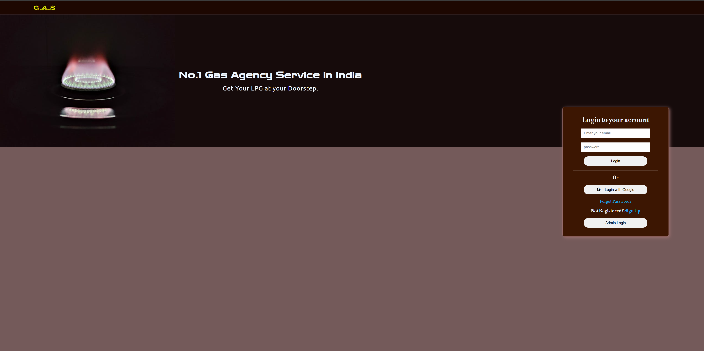

# dY>��,? Gas Agency System

An online gas cylinder booking platform designed for client convenience and administrative efficiency. This system replaces the outdated, time-consuming phone call method with a modern web-based solution.

---

dY`% [Visit Homepage](https://saptarshi1984.github.io/GasAgency/)

dY`% [Project Documentaion Link](https://drive.google.com/file/d/1Su9I3mnl5tInktZMgxFze3Fqv9v9NJCi/view?usp=drive_link) 

---

## Project Screenshots

  
  

---

## dYs? Project Objectives

* Simplify gas cylinder booking for customers via an online platform.
* Enable admins to manage customer requests, bookings, and notifications.
* Support dual account systems (User and Admin) with distinct privileges.
* Provide secure and testable code structure with Firebase backend integration.

---

## dY� Tech Stack Used

| Technology    | Description                |
| ------------- | -------------------------- |
| dY"1 HTML/SCSS   | Frontend design and layout |
| dY", JavaScript | Dynamic interaction logic  |
| dY"1 Firebase   | Backend services |

---

## dYc Features

### dY` User Functionalities

* dY"? **User Registration & Login** (via email)
* dY", **Cylinder Booking Requests** (standard + extra cylinders)
* dY"o **Booking History** (full access to user's past transactions)
* dY" **Email Notifications** (transaction confirmation with Email.js)

### dY>��,? Admin Functionalities 

* dY"< **Credentials to Login** - admin@gmail.com, admin@123      
* dY"< **View & Manage Users**
* �o. **Approve/Deny Booking Requests**

---

## dYs? Deployment

* dY"< **Deployed with GitHub**

## dY"S Evaluation Metrics

* �o. **Modular Codebase** �?" Easy to extend and maintain.
* dY"' **Safe & Secure** �?" Follows Firebase authentication best practices.
* dY� **Testable** �?" Designed to be easily testable at unit level.
* dYO? **Portable** �?" Works across major browsers and devices.

---

## dY"O Extra Notes

* Ensure Firebase rules are properly configured.
* Maintain clean Git commit messages.
* Keep README and comments updated.

---

