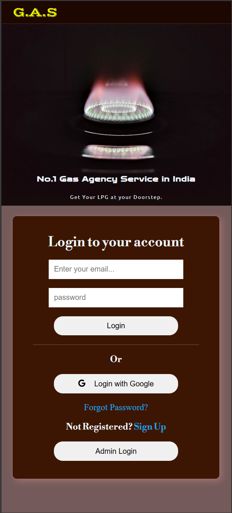

# Gas Agency System

An online gas cylinder booking platform designed for client convenience and administrative efficiency. This system replaces the outdated, time-consuming phone call method with a modern web-based solution.

---

 [Visit Homepage](https://saptarshi1984.github.io/Gas-Agency-Systems/)

 [Project Documentaion Link](https://drive.google.com/file/d/1Su9I3mnl5tInktZMgxFze3Fqv9v9NJCi/view?usp=drive_link) 

---

## Project Screenshots

<b>Project Screenshots</b>

&nbsp;

<b>Desktop</b>

  
  

&nbsp;

  
<b>Mobile</b>

  

---

## Project Objectives

* Simplify gas cylinder booking for customers via an online platform.
* Enable admins to manage customer requests, bookings, and notifications.
* Support dual account systems (User and Admin) with distinct privileges.
* Provide secure and testable code structure with Firebase backend integration.

---

## Tech Stack Used

| Technology    | Description                |
| ------------- | -------------------------- |
| dY"1 HTML/SCSS   | Frontend design and layout |
| dY", JavaScript | Dynamic interaction logic  |
| dY"1 Firebase   | Backend services |

---

##  Features

###  User Functionalities

*  **User Registration & Login** (via email)
*  **Cylinder Booking Requests** (standard + extra cylinders)
*  **Booking History** (full access to user's past transactions)
*  **Email Notifications** (transaction confirmation with Email.js)

###  Admin Functionalities 

* **Credentials to Login** - admin@gmail.com, admin@123      
* **View & Manage Users**
* **Approve/Deny Booking Requests**

---

## Deployment

* **Deployed with GitHub**

## Evaluation Metrics

* **Modular Codebase** �?" Easy to extend and maintain.
* **Safe & Secure** �?" Follows Firebase authentication best practices.
* **Testable** �?" Designed to be easily testable at unit level.
* **Portable** �?" Works across major browsers and devices.

---

## Extra Notes

* Ensure Firebase rules are properly configured.
* Maintain clean Git commit messages.
* Keep README and comments updated.

---

